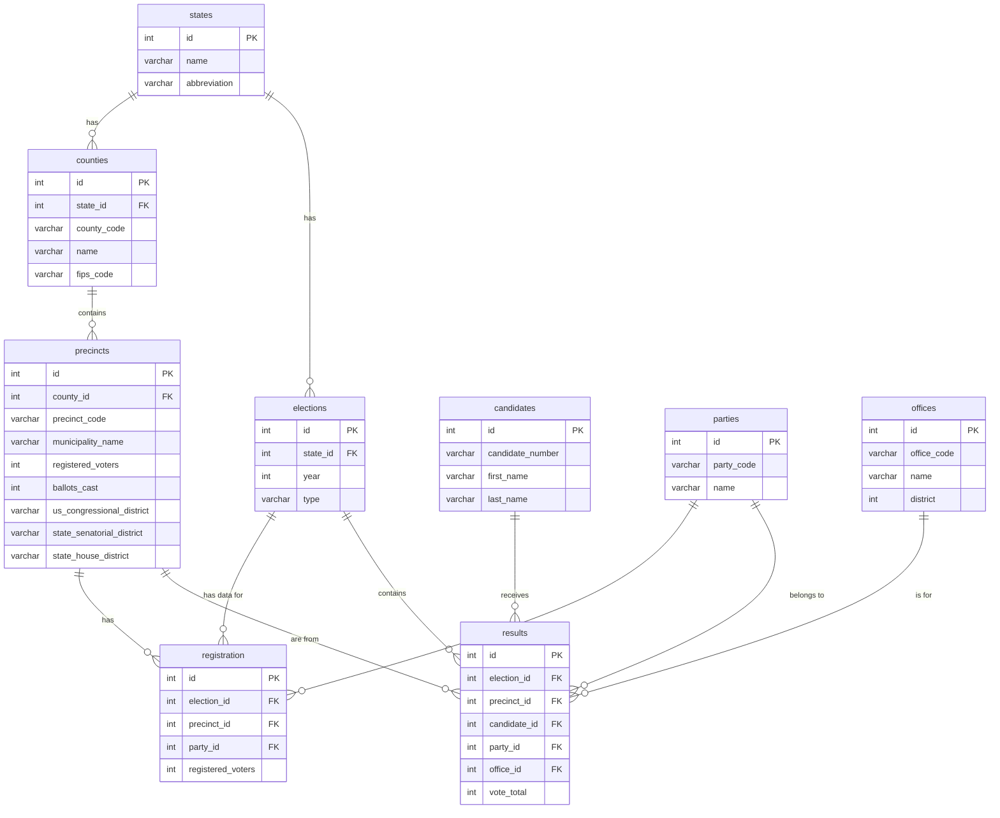

# Pennsylvania Election Data Warehouse

This project provides a complete data pipeline to ingest, clean, and store historical Pennsylvania election results and voter registration data into a unified SQLite database. It is designed to be a scalable and robust foundation for data analysis, machine learning, and AI-driven discrepancy investigation.

## Project Structure

-   `/data`: Contains the raw source data files, including election results and voter registration statistics for various years.
-   `/database`: Contains the final SQLite database file (`election_data.db`).
-   `/scripts`: Contains all the Python scripts required to build and populate the database.

## Database Schema

The database is designed with a normalized structure to ensure data integrity and query efficiency.

### Schema Diagram



### Table Descriptions

-   **`states`**: Stores state information (e.g., Pennsylvania, PA).
-   **`elections`**: Defines a specific election event (e.g., 2024 General Election).
-   **`counties`**: Stores county information, linked to a state.
-   **`precincts`**: The core geographic unit, linked to a county.
-   **`candidates`**: Stores unique information about each candidate.
-   **`parties`**: Stores unique information about each political party.
-   **`offices`**: Stores unique information about each elected office.
-   **`results`**: The central "fact" table, storing the vote total for a specific candidate in a specific precinct for a specific election.
-   **`registration`**: A "fact" table storing the number of registered voters for a specific party in a specific precinct for a specific election.

## How to Use the Scripts

The scripts in the `/scripts` directory are designed to be run from the root of the project.

1.  **`create_database.py`**: This script builds the `election_data.db` file and creates all the tables according to the schema. It will delete any existing tables, ensuring a clean slate.
2.  **`ingest_registration.py`**: This script reads all the `VoterRegistration_*` files from the `/data` directory, handles the different file formats (`.txt` and `.xlsx`), and populates the `registration` table as well as the core dimension tables (`counties`, `precincts`, etc.).
3.  **`ingest_data.py`**: This script reads all the `ElectionReturns_*` files from the `/data` directory and populates the `results` table, linking back to the records created by the registration script.
4.  **`verify_data.py`**: This script runs a few sample queries against the final database to confirm that the data has been loaded and joined correctly.

### Running the Full Pipeline

To build the entire database from scratch, run the following command from the project's root directory:

```bash
python3 scripts/create_database.py && python3 scripts/ingest_registration.py && python3 scripts/ingest_data.py